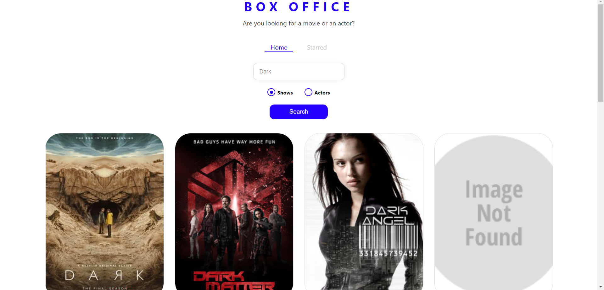
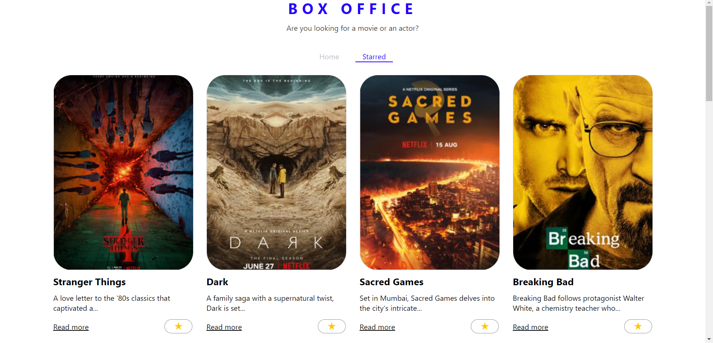

# Box-Office

## Table of contents

- [Overview](#overview)
  - [The challenge](#the-challenge)
  - [Screenshot](#screenshot)
  - [Links](#links)
- [My process](#my-process)
  - [Built with](#built-with)
  - [What I learned](#what-i-learned)
  - [Deployment](#deployment)
  - [Useful resources](#useful-resources)
- [Author](#author)

## Overview

### The challenge

To build a responsive Box-Office app using React. Here user can check the details of different web shows and  actors by searching their name. User can mark their favourite shows 
and those shows will be displayed under starred column.

### Screenshot

### Links

- Live Site URL: [Click Here](https://decodewithhappy.github.io/box-office/#/)

## My process

### Built with

- Semantic HTML5 markup
- React
- styled-component

### What I learned

I learned how to use React to make responsive applications. And learned how to use React router dom for dynamic routing, 
I have used styled-component library to style my application. 

### Deployment

#### Deploy Locally

1. Clone this repo by running git clone `https://github.com/DecodewithHappy/box-office.git`
2. Install dependencies by running npm install
3. Run npm run start

### Useful resources

- [Adobe Color](https://color.adobe.com/create/color-wheel) - This is a very good resource to get a varieties of color . I really liked the color wheel and will use it going forward.
- [Font Awesome](https://fontawesome.com/) - Here we can get several icons, logos which can be used in various places.
- [Google Fonts](https://fonts.google.com/) - A good resource through which we can get different types of fonts.
- [React Docs](https://reactjs.org/) - Official documentation of ReactJs

## Author

- Website - [Sayan Poddar](https://github.com/DecodewithHappy/TicTacToe-Game)
- Frontend Mentor - [@DecodewithHappy](https://www.frontendmentor.io/profile/DecodewithHappy)
- Linkedin - [@SayanPoddar](https://www.linkedin.com/in/sayan-poddar-71777222a/)
